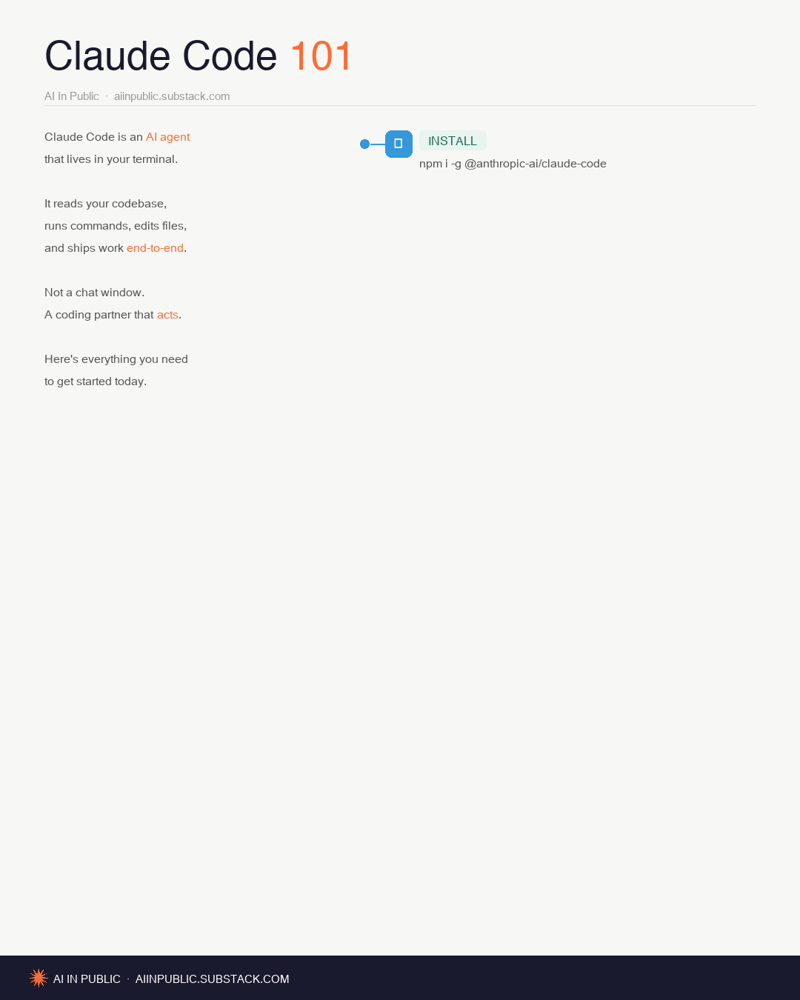
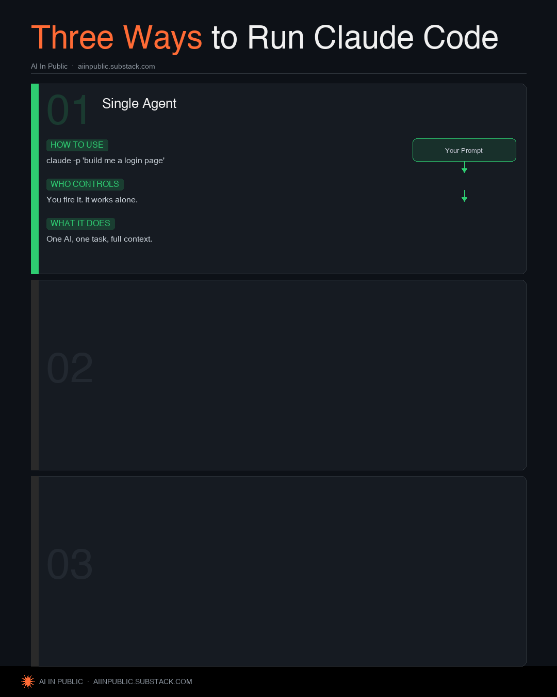
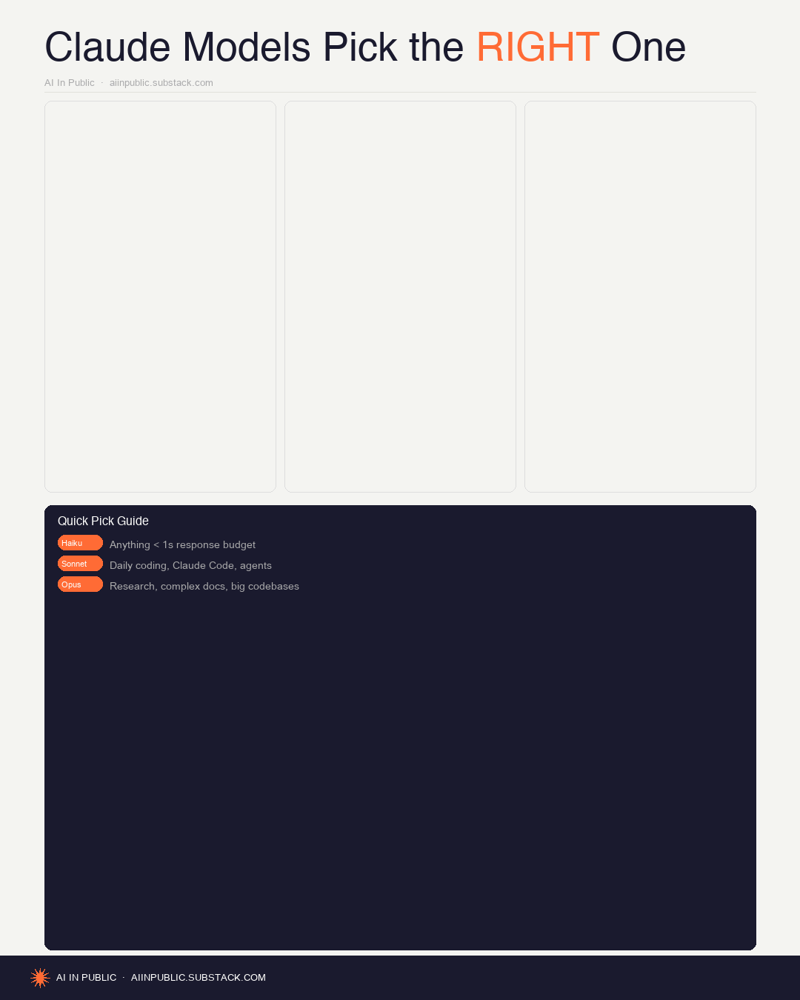
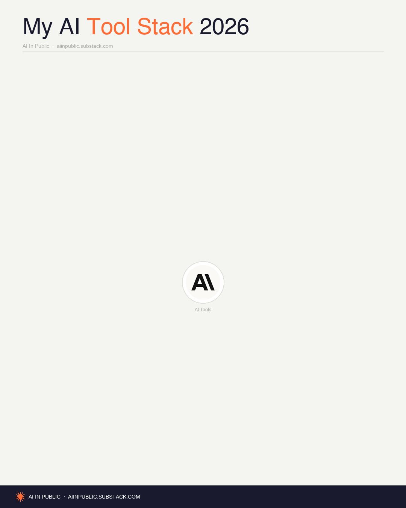
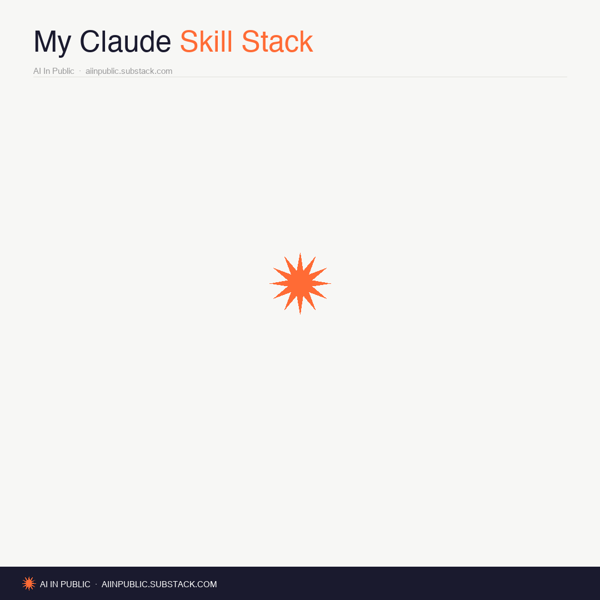
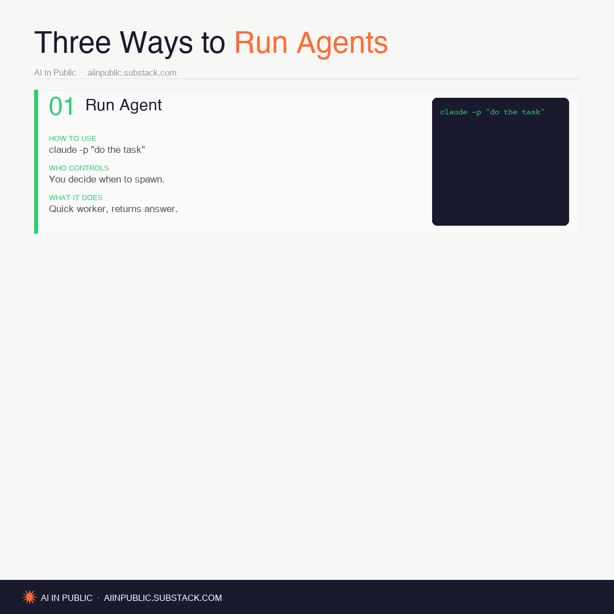
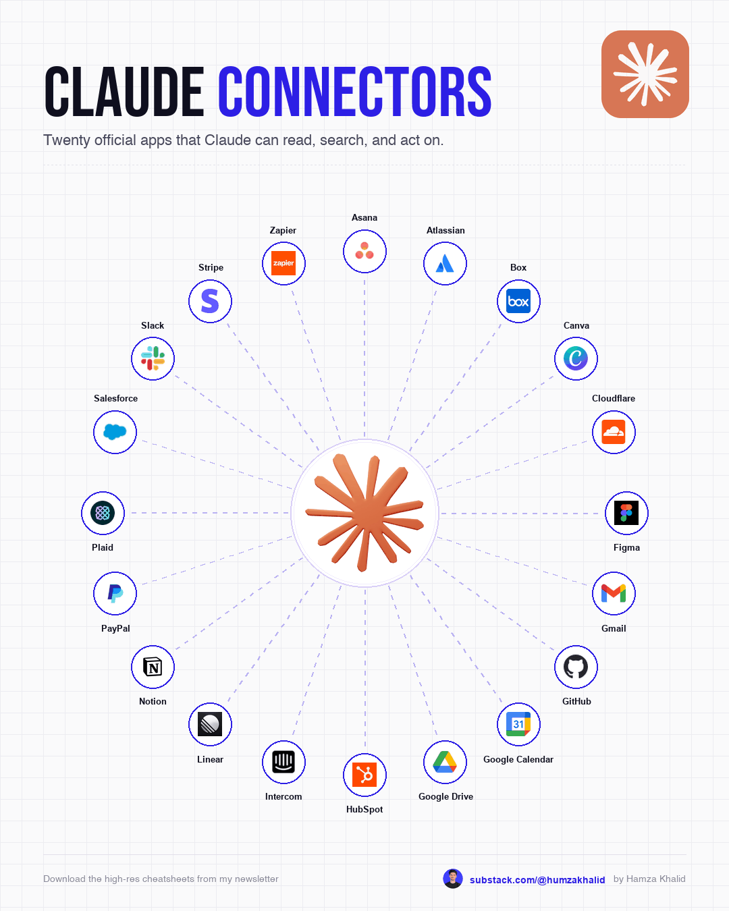
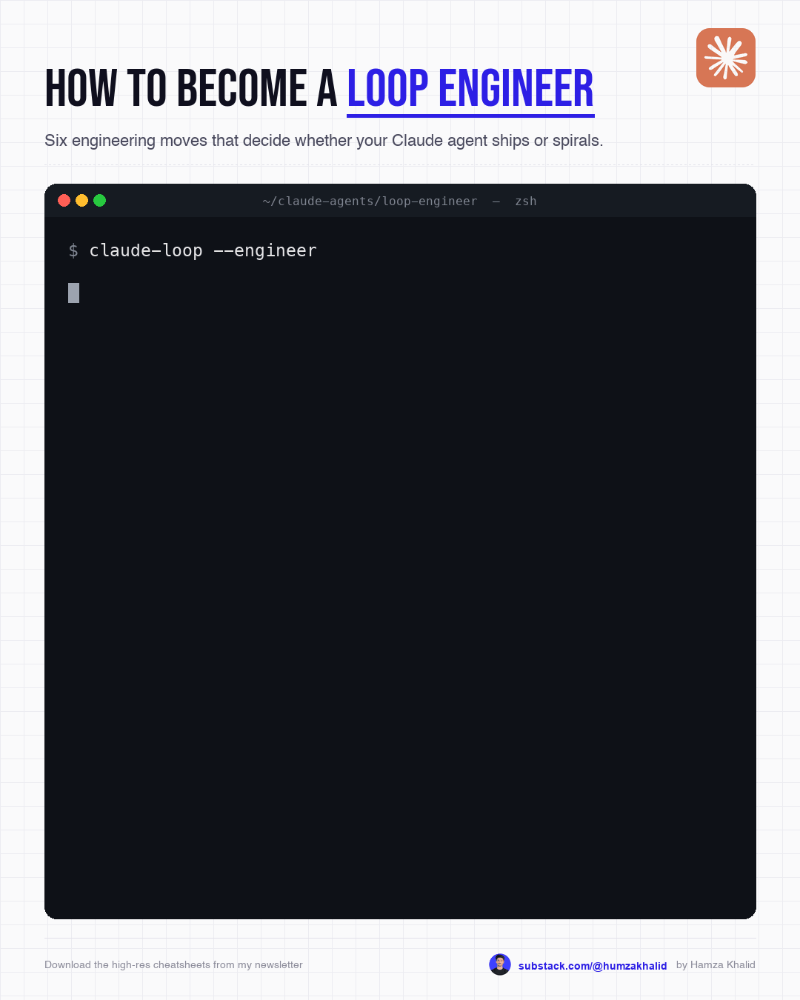
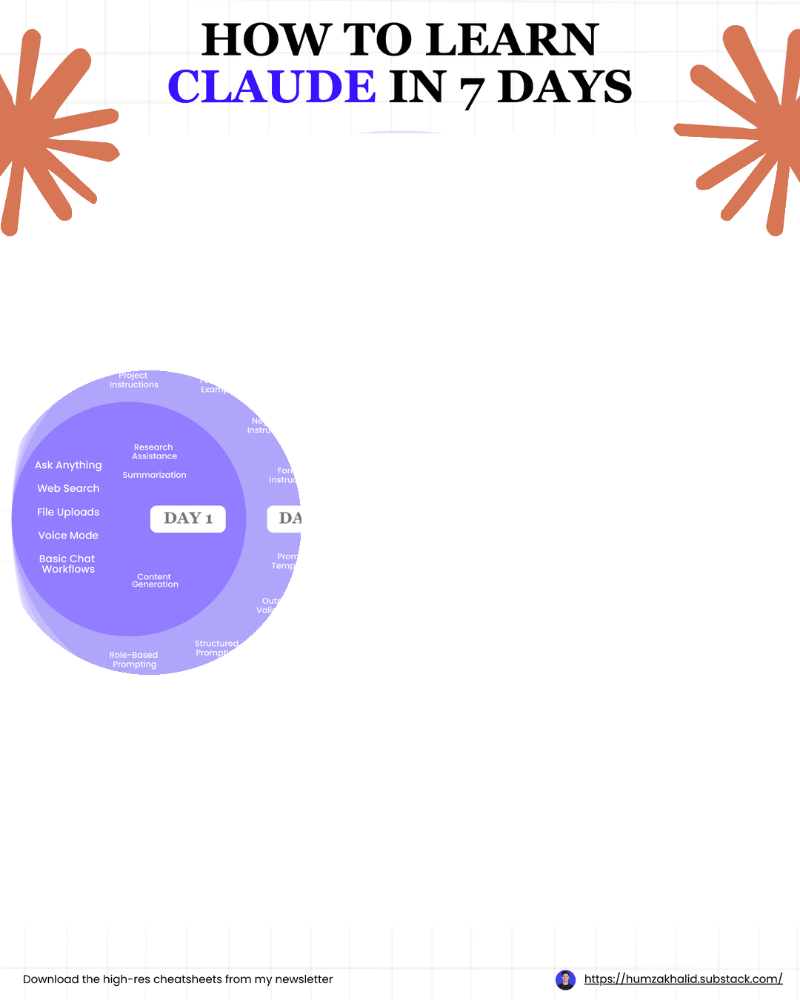

# /motion-graphics — Claude Code Skill

A Claude Code custom slash command that generates ready-to-publish **animated motion graphics GIF cheatsheets** at 1080×1350px (LinkedIn/Substack optimal format).

Drop a topic title → get a fully animated, branded GIF in seconds.

---

## Preview

| Claude Code 101 | Three Ways to Run Claude | Claude Models Compared |
|:-:|:-:|:-:|
|  |  |  |

| My AI Tool Stack | Radial Spoke | Tiered Levels |
|:-:|:-:|:-:|
|  |  |  |

| Claude Connectors | Loop Engineering | Learn Claude in 7 Days |
|:-:|:-:|:-:|
|  |  |  |

---

## How to install

1. Copy `motion-graphics.md` into your Claude Code commands folder:

```bash
cp motion-graphics.md ~/.claude/commands/motion-graphics.md
```

2. Install Python dependencies:

```bash
pip3 install Pillow
```

3. That's it. The skill uses macOS system fonts (Helvetica, Arial Unicode) — no extra font downloads needed.

---

## How to use

In any Claude Code session, type:

```
/motion-graphics Claude Code 101
```

```
/motion-graphics My AI Tool Stack
```

```
/motion-graphics Three Levels of AI Automation
```

Claude picks the best layout automatically, fills in the content from its own knowledge, generates the Python script, runs it, and opens the GIF for preview.

Output is saved to: `~/Desktop/Motion Graphics Cheatsheets/{slug}.gif`

---

## 5 Layout types

| Layout | Best for | Animation |
|--------|----------|-----------|
| **Progressive List** | How-to guides, tips, commands | Timeline spine grows + items reveal one per frame |
| **Radial Spoke** | Tool stacks, ecosystems, collections | Items appear clockwise around central logo |
| **Column Compare** | Models, platforms, A vs B | Columns reveal left to right |
| **Tiered Levels** | Beginner/intermediate/advanced | Level bands reveal top to bottom |
| **Dark Workflow** | Agent patterns, technical flows | Numbered sections on dark bg |

---

## Design system

- **Canvas:** 1080×1350px, 4:5 portrait
- **Brand accent:** `#FF6B35` coral orange
- **Logo:** 12-spoke starburst (Anthropic-style), drawn programmatically
- **Footer:** Dark navy bar `#1A1A2E` on every frame
- **Animation:** 900ms per frame, infinite loop, 2 hold frames at end
- **Fonts:** Helvetica (bold/title) + Arial Unicode (body) — macOS built-in

---

## Brand

Built for **AI In Public** · [aiinpublic.substack.com](https://aiinpublic.substack.com)

To change the brand, edit the `ATTRIBUTION` constant in `motion-graphics.md`.

---

## Requirements

- macOS (uses system fonts at `/System/Library/Fonts/` and `/Library/Fonts/`)
- Claude Code CLI
- Python 3 + Pillow (`pip3 install Pillow`)
